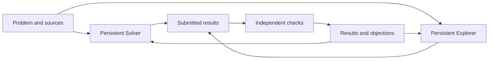

# Persistent research sessions

Replacement design for Inventio, proposed on 2026-09-05. This specifies the
next framework; the running implementation still follows TRAJECTORY-DESIGN.md.
The owner has explicitly removed backward compatibility as a requirement for
this redesign. Implementation should replace the old workflow, not maintain
another execution path alongside it.

## Central decision

A project has exactly one Solver session and one Explorer session. Each keeps
its conversation, private working directory, and mathematical notes throughout
the investigation. Both use an explicitly selected strong research model.
They may run concurrently, but there are no additional researchers, rounds,
rosters, or periodic fresh starts.

The Solver pursues the original problem. The Explorer pursues relevant
examples, alternative approaches, special cases, and obstructions. Their
methods remain their own choices. The runtime owns execution, delivery of
messages, budgets, and evidence records; it makes no mathematical plans.

The owner's experience motivates this allocation. It is a working design
choice, not a measured claim that two persistent sessions outperform every
other allocation on every problem.

## Research lifecycle

1. Preserve the owner's problem and sources verbatim. The owner starts the
   project directly from these materials. No mandatory intake-model rewrite
   or separate initial mathematical summary is needed. A researcher can ask
   the owner about a material ambiguity without silently changing the goal.
2. Start the Solver and Explorer once, with distinct private workspaces and
   stable session identities. Keep the research instructions and tools stable.
3. Let each work for a long uninterrupted stretch. It maintains its own notes
   and calculations. It may publish a useful note or submit a complete result
   through project-scoped tools without ending its research session.
4. Check submitted results asynchronously. Deliver feedback to their author;
   a revision continues the same investigation in the same conversation.
5. At a natural model-turn ending, retain a small checkpoint: current draft,
   next mathematical step, and whether to continue, wait for feedback, ask the
   owner, or finish. A continuation is another turn in that session, not a new
   research assignment. Never require a result merely to justify continuing.
6. Stop on a checked decisive result, owner stop, exhausted allowance, or both
   researchers finishing without a decisive result. Preserve useful partial
   work and open questions. Operational failures pause affected work; they
   are not mathematical disproofs.

There is no end-of-round comparison call, summary editor, or automatic final
writing call. Ordinary progress is the researchers' own readable work. A
checked result already contains its statement and proof. At stopping, the
runtime assembles a report from these records with their current qualifications.
An optional paper-writing pass remains a separate owner-requested action.

## What one long session means

A session is a durable research identity, not an immortal operating-system
process or an unlimited context window. Process restarts and later turns reuse
the same provider conversation and working directory. Context compaction may
still occur; mathematical notes, source excerpts, scripts, and submitted
versions must survive it as files. Compaction is not an occasion to create a
new researcher or ask another model to reconstruct a global plan.

Maintain one private notes document per researcher, updated at meaningful
pauses rather than on a token or clock schedule. Keep the actual derivations
in ordinary files and link them from the notes. Do not repeatedly rewrite or
prepend the whole project history to continuation requests.

Initial implementation should reuse the existing CLI process driver and
same-thread resume capability behind a small session interface. One process
at a time may advance a given session. If a saved provider conversation is
unavailable, pause and expose recovery from the saved files as an explicit
replacement session. Never silently describe a fresh context as a resumption.

## Communication

Proposed default: the two researchers can share selected mathematical notes
and checked results. They cannot read each other's private workspace or full
transcript. Notes are attributed and visibly unchecked; passing a note does
not certify its assertions. There is no requirement to debate, reply, reach
consensus, or send periodic updates.

The runtime appends a small notification when a relevant note, review, result,
or owner instruction arrives. The recipient can read updates during work or
at its next natural pause. Notifications contain identifiers and short
descriptions; full mathematics is fetched only when useful. Reading an update
does not create another model call. Do not interrupt a substantial derivation
merely because the other researcher has posted something.

This separates research collaboration from independent checking. A verifier
never inherits either researcher's conversation, private notes, or prior
verifier verdicts.

## Results and verification

### One result record, with immutable versions

Keep one result entity instead of a claim entity plus a promoted fact copy.
Each submission freezes its statement, proof, declared relation to the goal,
source references, any calculation attachments, and dependencies on exact
versions of other results. Content hashes identify what was actually checked.
Changing the proof or its hypotheses creates a new version; previous passes
do not transfer automatically.

Researchers may retain unlimited ordinary scratch work within storage limits,
but each has at most one unresolved submitted version in the review queue.
It can continue other mathematics while that version is checked. This avoids
turning every small observation into two expensive model calls. Reject exact
resubmissions already checked or queued; do not infer mathematical equivalence
using a separate model pass.

### Two independent checks, scheduled sequentially

Use a fixed two-check rule instead of configurable W-out-of-V voting:

1. A fresh verifier checks the complete frozen submission, including its
   dependencies, source hypotheses, and relation to the original problem.
2. If it finds an incorrect step or missing justification, return that report
   to the author. Do not spend the second check on the same defective version.
3. If it passes, a second fresh verifier checks the same complete version,
   with particular emphasis on independently deriving the decisive step. It
   receives neither the first verdict nor the first report.
4. Both must pass that exact version. An explicit objection or unresolved
   incompatible calculation prevents the result from becoming settled.

Both checks assess the whole argument; the first is not a cheap stylistic
screen. For a TRR calculation, the report must derive the relevant surviving
terms and justify omitted terms before cancellation. Do not add a separate
model just to decide whether the proof is ready to be checked.

Two passing reports still do not constitute a formal correctness guarantee.
This preserves independent scrutiny while avoiding duplicated reviews of a
proof already found incomplete. It can increase latency for successful
submissions; research proceeds while the queue runs.

### Conflicts and unsettled premises

Each verifier receives the original problem, frozen target proof and its
authorized source material. It also receives a compact catalog of submitted
statements, with complete statements available on demand. Other proof texts,
acceptance labels, and referee reports are absent. The catalog is for noticing
incompatibilities, not for supplying missing proof steps or choosing a side
by apparent consensus. Capture its exact version in the review record.

Report concrete conflicting pairs in the same review return, alongside the
proof assessment. The runtime records these observations and propagates them
through explicit dependencies. A failed opposing proof does not establish
that its statement is false. A withdrawn submission also does not dispose of
a concrete mathematical objection. A conflict is resolved by a recorded owner
assessment or a checked mathematical reconciliation, not by another vote.

For the disputed D case, an accepted nonzero residual and an incomplete
derivation of a zero residual remain a conflict. Neither is silently discarded
because one passed more checks. The author must reconcile the contributing
terms, and any revised proof is reviewed as a new version.

Before the second check of a potentially decisive submission, request final
checkpoints from both researchers and stop launching research continuations.
Let their current turns yield and their in-flight submissions become durable;
only then seal the submission boundary and finish relevant pending reviews.
Give the final verifier a catalog covering that frozen record. If
checkpointing or coverage is incomplete, keep the result unresolved. This
prevents a success report from racing an opposing calculation in the other
session. If the final check fails and allowance remains, resume the same
research sessions with the feedback.

After stopping, later owner amendments remain visible and can unsettle the
current result. Saved reports retain the evidence and qualifications that
existed when written.

### Computation evidence

Retain the existing parent-owned command archive, execution outcomes, hashes,
and distinction between derivation and computational support. An unsuccessful
execution cannot support a computational PASS. Successful execution does not
prove that the code implements the right mathematics. Never run worker code
in the conductor's unrestricted process to reproduce a calculation.

External source text is copied or retrieved with precise provenance and
conventions. A locally cached source prevents unnecessary fetching; it does
not certify the source's applicability or a solver's reduction of it.

## Efficiency and limits

- There are two research sessions and, by default, one active verification
  process. No routine manager, summarizer, statement matcher, or synthesizer.
- Keep a project-wide allowance and a review reserve. Reserve allowances for
  active work before launching it so both researchers cannot spend the same
  remainder. Give each a substantial research allocation; expose the split
  as an advanced setting rather than multiplying role/round/task controls.
- Keep existing conservative in-flight estimates until completed usage is
  available. Missing usage is unknown, not free. A hard exact monetary ceiling
  cannot be promised when the provider supplies delayed or incomplete usage.
- Prioritize pending verification when a process slot becomes free. Waiting
  researchers release their slots. Pause/resume, budget exhaustion, and
  service recovery operate per session, with a project-wide stop as well.
- Do not impose periodic checkpoints, minimum word counts, or automatic
  "think again" calls. An unchanged checkpoint with no new input must not
  cause an unbounded chain of paid continuations. Let the researcher explicitly
  wait or finish, and show that status to the owner.
- Bound infrastructure retries and schema repair. Never automatically retry
  a mathematically failed proof until its author submits a new version.

### Prefix reuse

The main opportunity is preserving each long session's own growing context.
The two checks of one frozen proof also have substantial common input. Keep
stable mathematical instructions and authorized reference material together,
and put varying identifiers, updates, and review emphases afterward where the
transport permits. Do not import solver reasoning into a verifier to obtain
a larger cache hit.

Exact caching depends on the rendered request, including tools, output schema,
and provider settings. Identical files or a reused conversation identifier
alone do not guarantee a hit. Current CLI-generated context must be measured
before promising cross-session prefix savings. A different transport is an
optional optimization if evidence justifies its added implementation surface.
See [OpenAI's prompt caching guide](https://developers.openai.com/api/docs/guides/prompt-caching).

Report uncached input, cache reads, cache writes when available, output tokens,
and elapsed time separately. Keep unknown fields explicit. The old
uncached-input-plus-output budget proxy is not a monetary cost estimate.
Compare total cost as well as cache-hit rate; do not add irrelevant material
or keep an unhelpful context solely to increase cached-token counts.

## Small implementation surface

Retain TypeScript, the local HTTP/SSE server, simulator, Markdown artifacts,
and one append-only event log. No new database, distributed queue, or agent
framework is required.

The core records are a project, its two sessions, immutable result versions,
independent reviews, and attributed messages/challenges. Session turns are
execution records, not another mathematical task hierarchy. Review status and
settled-result eligibility are derived from those records.

The runtime needs six cohesive responsibilities:

| Responsibility | Scope |
| --- | --- |
| Session execution | Start/resume, private workspace, process lifecycle, usage |
| Scheduling | Two researchers, review queue, reservations, stopping |
| Research records | Immutable submissions, notes, messages, provenance |
| Verification | Sealed packets, sequential independent checks, evidence |
| Persistence | Event append/replay, artifact writes, lease, recovery |
| HTTP/UI | Controls and readable projections of those same records |

Tools should cover source/library reading, receiving updates, sharing a note,
and submitting a result. Reuse the existing bounded source readers and path
confinement. The conductor alone freezes shared artifacts and writes events.
There is no need for separate memory cards, milestone entities, claim/fact
copies, candidate lineages, or a model-maintained global summary.

The main interface shows two persistent research panels, a review queue, and
a results library. Each panel shows current notes, activity, allowance, and
pause/continue controls. Open a result to see versions, exact proofs, reviews,
execution evidence, and any conflict or dependency concern. Keep source and
transcript access, owner steering, readable Markdown, and portable export.
Remove the round graph and legacy role settings. An optional dependency view
should serve a concrete question rather than dictate the data model.

## Replacement sequence

1. **Specify the new record and session contract.** Define only the new project
   format, two stable session identities, immutable results, messages,
   reservations and reviews. Establish a simulator scenario in which both
   researchers continue across several turns and a service restart.
2. **Build the vertical runtime slice.** Implement intake, start/resume,
   notes, submissions, update delivery and the simple queue. Reuse the tested
   process, storage and confinement utilities where their interfaces fit.
   Do not extend the current wave loop with another compatibility branch.
3. **Connect verification and stopping.** Carry forward execution evidence,
   explicit dependencies and conflict warnings. Add sequential review and the
   frozen final-record barrier. A failed check goes back to its original
   author session. No unsupported result can trigger a decisive stop.
4. **Replace the UI and remove the old framework in the same cutover.** Use
   the two-session view and new results library. Remove council replay,
   trajectory rounds, old schemas/reducers, unused tools, graph components,
   legacy settings, and redundant design documents. Keep no runtime migration
   or compatibility adapter. Old project directories are not modified or
   deleted; unsupported formats are reported clearly and are never launched.
5. **Validate and measure.** Run simulator tests and all repository checks.
   Use expert-labelled saved mathematics only when explicitly selected for
   evaluation. A live comparison requires a separate request; use a fixed
   total allowance and record success, false acceptance, false rejection,
   time, and all available usage components. No performance improvement is
   established by the design or simulator alone.

Use a development branch for the replacement. Ship one completed workflow,
not two partially supported engines. The current implementation remains usable
until the new vertical slice, interface and removal are ready together.

## Acceptance scenarios

- Exactly one Solver and one Explorer identity, with no concurrent turns in
  either; ordinary continuation and service recovery retain their histories.
- A result is submitted while its author continues work; its review returns
  to the same session without restarting the other researcher.
- A failed first check spends no second call. Two passes bind to one exact
  proof version. A revised version starts without inherited passes; an older
  version's record is not rewritten merely because a revision was submitted.
- The D analogue remains unresolved when the opposing proof is incomplete;
  disputes propagate to dependent results without rewriting historical votes.
- A late opposing submission cannot be lost during decisive final checking.
  Interrupting that check preserves an unresolved result and its evidence.
- Failed commands do not certify computation. Saved review recovery consumes
  no duplicate call or charge; missing provider history is exposed explicitly.
- Duplicate tool submissions, torn event tails, budget contention, owner
  pause/stop and an unavailable source never create duplicate results or work.
- Neither researcher can read the other's private files; verifiers cannot
  read author histories or other verifier verdicts. Source-copy limits hold.
- Unsupported old projects receive no execution or writes. New-format replay,
  HTTP/UI projections, simulator fixtures and exports agree.

## Status

This turn records a replacement specification and removal plan. It does not
change the running scheduler to persistent sessions or claim measured cache
savings. The four validity safeguards implemented in 350488a remain useful
components to carry forward; their old entity layout is not a constraint.
