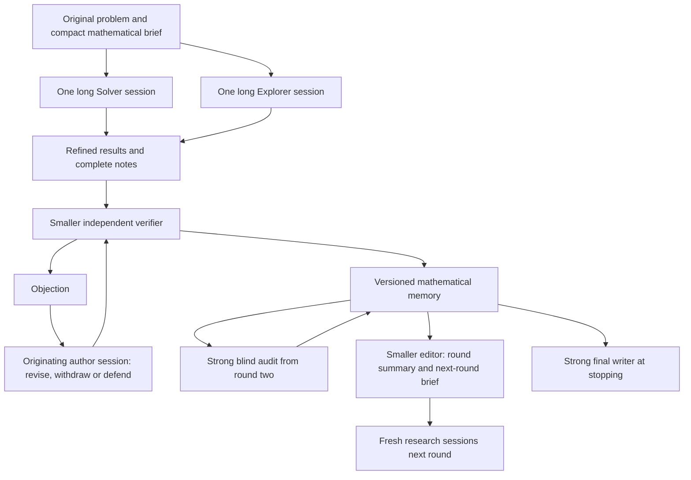

# Recurrent research with independent memory audit

Replacement design, revised on 2026-09-05 with the owner's feedback. This
supersedes the earlier proposal for two project-long conversations without
rounds. The running implementation still follows TRAJECTORY-DESIGN.md.
Backward compatibility is not a requirement for the replacement.

## Central decision

Keep recurrence. Each round has one long Solver session and one long Explorer
session, using the strongest research model selected for the project. They
produce refined mathematical results, calculations and useful notes. The next
round starts fresh from the original problem and a compact, faithful account
of the durable mathematics, with the complete note library available on demand.

Retain an originating session for responding to objections about its results.
Do not carry that session's detailed thinking history into the next round's
researchers. This separates continuity needed for a repair from the fresh
perspective needed for a new investigation.

The owner reports that long, strong trajectories and recurrent distillation
have worked well. Preserve that philosophy while improving classification,
verification and memory integrity. Smaller models handle routine checking and
editorial work. A separate strong auditor independently inspects mathematical
memory from round two onward. No model manages the researchers' methods.

## Roles and authority

Use two model settings initially: research and support. Pin the actual model
choices when a run starts; do not silently change them during a conversation.

| Role | Model | Responsibility | Authority |
| --- | --- | --- | --- |
| Solver | Research | Attack the original problem; refine results; respond to objections | Author its own result versions and notes |
| Explorer | Research | Pursue useful examples, methods, special cases and obstructions | Author its own result versions and notes |
| Verifier | Support | Independently check a frozen result and identify concrete defects | Record a check or objection, not rewrite the author's mathematics |
| Memory auditor | Research | Independently audit every established fact, dependencies and consistency | Confirm, quarantine, downgrade or retract with mathematical reasons |
| Editor | Support | Organize notes, write round summaries and the next-round brief | Presentation and indexing only; no acceptance decisions or research directions |
| Final writer | Research | Produce one coherent, self-contained final report | Exposition of supported mathematics; no new acceptance decisions |
| Runtime | Code | Schedule, isolate, preserve evidence, meter usage and apply validated decisions | Sole writer of shared durable state |

The default proposal is one support-model verifier per submitted proof version,
followed by the independent strong audit of mathematical memory. This replaces
the earlier proposed fixed pair of routine checks. The author is never its own
independent verifier. Strong audit also covers disagreements the weaker checker
cannot resolve. Measure this allocation against the previous verification
policy before claiming equal or better accuracy.

## The round lifecycle

1. Start from the owner's original problem, source catalog, a concise
   mathematical brief and the memory index. Preserve original hypotheses and
   terminology. A material ambiguity becomes a question for the owner.
2. Launch exactly one Solver and one Explorer, each with a long private
   session and working directory. They choose their own methods and timing.
   No prescribed sequence of mathematical microtasks or periodic progress call.
3. During useful pauses they may share notes, consult the full project note
   library through MCP and submit a worthwhile self-contained result. At the
   end of their main work, they refine the write-up and classify what it
   actually establishes. A round need not invent a positive result to finish.
4. Verify submissions and route any disagreement back to their originating
   author sessions. Revisions are bounded and preserve exact proof versions.
5. From round two, run a separate strong auditor in parallel with research.
   It starts with every established fact in memory, then checks newly admitted
   facts before the round's audit is declared complete.
6. At the round boundary, finish the admitted checks and bounded author
   responses. Seal the result versions and let the auditor finish its remaining
   targets. An unresolved objection or unfinished audit stays explicit; it
   cannot be hidden by closing a round.
7. The editor writes the user-facing round summary and a compact next-round
   brief from that sealed record. Launch fresh Solver and Explorer sessions
   for the next round if useful work and allowance remain.

Service recovery resumes an interrupted session in the same round. A new
research round deliberately starts new provider conversations. These are two
different transitions in the runtime and UI, not a single generic resume.

## Context and the note filesystem

Use the existing project-scoped MCP for catalog/search/open access. Do not
introduce a second memory service or a model memory manager. A small index is
always present; all saved mathematical notes, result versions, calculations,
source excerpts and unsuccessful approaches are available to researchers on
demand, including items omitted from the next-round brief.

Catalogue every saved mathematical note in the designated notes tree at a
checkpoint, including drafts. The author does not need to nominate each note
for promotion or send a notification to make it discoverable.

Selected notes and checked results are shared at natural pauses. Selection
controls notifications and initial context, not whether a researcher is allowed
to find the rest of the mathematical record. Unchecked notes and disputed or
retracted results remain accessible with their current qualifications.

Publish immutable snapshots of saved notes at natural pauses so readers never
see half-written files. Researchers cannot mount or modify each other's live
scratch directories. MCP exposes a logical project filesystem with bounded
reads and stable document/version identifiers; it does not grant arbitrary
host filesystem access. Keep source-copy limits and project confinement.

Distinguish deliberate mathematical notes from raw model execution traces.
Discard detailed traces from future research context; retain the original
session and execution archive for author repair, recovery and owner inspection.
They are not part of the ordinary researcher memory tools. Do not permanently
delete the only evidence needed to revisit an incorrect result.

The next-round brief contains useful results, open questions, concrete failed
approaches and precise links. It carries no model confidence scores, rankings
of researchers, or narrative that an approach must succeed. Full statements
and proofs remain authoritative over their editorial summaries.

## Result classification

Separate the kind of mathematical content from its verification status and its
relation to the goal. One label must not try to express all three.

| Content kind | What must be recorded | How it can be used |
| --- | --- | --- |
| Proposition | Exact statement, hypotheses, scope and complete alleged proof | A premise only with its current checking qualifications |
| Calculation or example | Inputs, conventions, derivation or script, exact versus numerical scope | Evidence for the stated calculation, not an unsupported general theorem |
| Conjecture or question | Precise unresolved assertion or question | A research direction or explicit assumption, never an established premise |
| Research note | Approach, partial derivation, obstruction or unsuccessful attempt | Context to consult, not a proof or a disproof merely because an attempt failed |

An exact calculation with a proof may itself establish a proposition. Finite
numerical evidence does not become a general theorem through reclassification.
The author specifies the content kind and supported scope. The editor can
organize these records but cannot strengthen their mathematical status.

For a checkable result version, show a small independent status vocabulary:

- UNCHECKED: no completed supporting independent check.
- CHECKED: routine verification supports this version; strong audit is pending.
- AUDITED: strong independent audit supports this exact version.
- NEEDS_REVISION: the submitted proof or dependencies are incomplete.
- DISPUTED: a concrete objection or incompatible calculation is unresolved.
- RETRACTED: this version has been withdrawn from usable mathematical memory,
  with the mathematical reason preserved. Retraction need not prove its
  statement false; record a disproof only when one is actually supplied.

Queue/running/error states are operational, not mathematical classifications.
Keep scope (proves the goal, disproves it, partial, related) separate; the
checker and auditor must assess that scope as part of their review.

Store one versioned result record rather than a claim plus a separate promoted
fact copy. A version freezes its statement, proof, attachments, source
references and dependencies on exact other versions. A changed proof receives
a new version and does not inherit old passes. An unaffected older proof can
remain valid; a new version is not by itself a refutation of the old one.

CHECKED and AUDITED results form working mathematical memory, with the
difference visible. Researchers may explore using a checked but unaudited
premise, while decisive acceptance requires strong audit of the conclusion and
its nontrivial dependency closure. A quarantined premise immediately makes
dependent results unsettled. Do not present a merely checked dependency as
already audited, or propagate certainty through a cycle or missing reference.

## Verification and author response

Give the support verifier the original problem, exact target statement and
proof, and authorized mathematical dependencies and sources. Do not provide
the author transcript, researcher commentary, other verdicts or expectations
about which conclusion should win. A verifier can report inability to check;
lack of expertise or a failed tool invocation does not refute a statement.

At least one disagreement is enough to trigger an author response; it does not
need a majority. If more than one check is running, collect the available
objections before resuming the author rather than creating a repair turn for
each arrival. Distinguish mathematical error, proof gap, missing dependency
and operational failure. Mere stylistic preference does not block acceptance.

The runtime appends the exact mathematical objections and their target
version to the saved session that produced the result. The author may:

- Revise: agree with the objection and supply a corrected, self-contained
  proof as a new version.
- Withdraw: agree that the result is unsupported and state precisely what
  remains usable.
- Defend: disagree and give a concrete mathematical response to the alleged
  defect, rather than insist that the stronger model must be right.
- Leave unresolved: identify the step it cannot currently settle.

An author response is not an independent PASS. A revised proof is checked
again in a fresh verifier context. If the author defends the original, keep
both the objection and the mathematical defense until independently resolved;
do not erase the dissent or automatically prefer the weaker checker.

Give defended or disputed mathematics to the strong auditor as self-contained
arguments or competing calculations, stripped of model identities and verdict
labels. Its job is to settle the mathematics, not arbitrate reputations. A
fresh independent check of the response must address the concrete issue; a
generic PASS does not dispose of a specific counterexample.

Allow two author-response cycles per result per round as an initial operating
limit, counted across versions. After that, retain the dispute for audit or
later work instead of running an unbounded checker-author debate. Cache hits
and repeated assertions do not justify more retries. This limit is a budget
policy to evaluate, not a mathematical stopping theorem.

Within a round, queue feedback until the author's active turn yields. Only one
process may advance a provider session at a time. When a later audit challenges
an older result, resume its older originating session for repair at a natural
pause in current research. Serialize these repairs with the corresponding
research role; do not spawn another independent Solver to reconstruct it.

Append feedback without rewriting the earlier context. Keep the original
workspace, tools and output contract where possible. Reusing the conversation
preserves useful context, but a provider cache hit is conditional on prefix
matching and cache availability, particularly after several long rounds. If
the old conversation cannot be resumed, expose that failure and offer a
clearly identified fresh repair context from the saved mathematics.
See [OpenAI's prompt caching guide](https://developers.openai.com/api/docs/guides/prompt-caching).

## Independent audit of mathematical memory

Each round from the second has one new, strong audit session, running in
parallel with the Solver and Explorer. Every established fact is in scope,
including unchanged facts audited in earlier rounds. Previous audit passes
are not a substitute for this round's audit. Dependency ordering can reduce
repeated work within one audit, but every target needs an explicit assessment.

At launch, seal an audit manifest of exact result versions and their hashes.
Supply only the mathematics: statements, complete proofs, calculations,
required definitions, dependency bodies and original source citations. Remove
model names, prior PASS/FAIL counts, confidence, summaries of previous reviews,
researcher commentary and managerial recommendations. Preserve citations to
actual mathematical sources. Use a separate read-only MCP projection and
packet; hiding commentary only in the prompt is insufficient.

A blind audit still sees the submitted proof; it is not a derivation from a
bare conclusion with no supporting material. For delicate steps it derives
from definitions or the original source formula independently. For the D
case, this means writing the relevant TRR terms and contractions before
cancellation, and comparing incompatible calculations on that basis.

The auditor can record justified changes as it works:

- Confirm a version after checking its proof, scope and dependencies.
- Quarantine a fact immediately when a concrete defect or contradiction is
  found; propagate the warning through its dependents.
- Downgrade an overclaimed result to unresolved or to the scope actually
  justified. A changed statement is a new version, not an overwritten theorem.
- Retract an unusable version with the reason, preserving its text and evidence.
- Resolve a dispute or restore eligibility when the mathematical objection
  has been explicitly answered by a checked argument.

The runtime validates target identities, versions and evidence and writes
these changes as events. The auditor has real authority over usable memory,
but no raw filesystem write access to shared records and no authority to erase
history. It does not brief researchers on what strategy to pursue. Editorial
opinions or unsupported doubt are not sufficient to retract a result.

A corrected or split theorem proposed by the auditor is new mathematics. It
must receive an independent check before admission; the auditor cannot act as
both its author and its only verifier. A mathematical disproof, proof defect,
missing source and operational inability remain distinct findings.
Its own proposed correction cannot receive AUDITED status from that same
session; a later independent audit must assess the new version.

Track coverage per exact version. New checked facts and revised versions
arriving during the round join an explicit audit tail. At closing, seal that
tail so completion has a finite meaning. An assessment of an obsolete version
does not certify its replacement. Unfinished, unavailable or failed audit work
remains visible, and no round or final report calls the audit complete unless
all required targets have substantive assessments. An operational error or
inability to inspect a proof leaves that target unassessed. An assessment can
be a rigorous objection; coverage is not the same as every result passing.

## Round summaries and final writing

Both are first-class user outputs. Use the support editor for recurring
summaries and reserve one strong writing pass for the final mathematical
exposition. Research sessions need not repeatedly narrate their activity.

Once the round's record is sealed, one editorial call produces:

1. A substantial readable round summary: what was established, under which
   hypotheses, the decisive mathematics, corrected errors, useful unsuccessful
   approaches, and the questions still open.
2. A shorter next-round brief and source-linked index updates. These point to
   the full note filesystem rather than replacing it.

The editor receives complete relevant result texts and current qualifications,
not merely verifier one-line verdicts. It may reorder, format, link and shorten
exposition. It cannot promote a conjecture, drop a hypothesis, resolve a
conflict, silently repair a proof or prescribe the next research strategy.
Canonical statement/proof blocks remain bound to their source versions and
are inserted directly by the runtime. The editor writes exposition around
them. A compact brief can use a title and link instead of reproducing a long
statement, but a paraphrase cannot replace its formal hypotheses or conclusion.
Current status and conflict notices are also projected from the record rather
than inferred by the editor.

At stopping, a separate final writing pass produces a coherent, self-contained
mathematical report with the original problem, established results and their
proofs, sources, limitations and open questions. It is not just an event list
or a concatenation of round summaries. Use the research model for this one
call: coherent mathematical exposition can require judgment beyond secretarial
work. Supply the complete audited mathematics and source material.

The runtime fixes the outcome and eligible result versions before composition.
The writer cannot turn an unresolved investigation into PROVED or DISPROVED.
Missing mathematical transitions are exposed, not invented for narrative
smoothness. Any issue requiring a new argument returns to an author/auditor
within the allowance. If editorial generation fails, retain a deterministic
readable fallback and the full underlying results.

## Stopping and cost discipline

A potentially decisive result does not stop the project while the other
researcher may still submit an opposing calculation. Request closing
checkpoints, finish admitted bounded responses, freeze the result record,
and complete strong audit of the decisive proof, its dependencies and relevant
conflicting statements. New versions reopen the affected audit targets.
The current round's full memory audit must also have complete coverage before
a decisive stopping report; unrelated challenged facts may remain explicitly
quarantined without defeating an independent audited proof.

If research ends in round one, run the strong final audit before declaring a
decisive result; otherwise the audit layer would be bypassed. A partial or
budget-limited stop can remain UNCERTAIN with incomplete audit coverage stated
explicitly. Round and final writing must preserve this distinction.

Use one project allowance with reservations for research, verification/repair,
audit and writing. Reserve audit and final-writing capacity before launching
another long round. The strong audit of all memory can become the dominant
cost as the library grows. Do not silently sample facts or replace the
requested full audit with checking only changed items. If the allowance cannot
cover it, report incomplete coverage and reduce further research or stop.

The economical default adds one routine check per submitted version, bounded
returns to an existing author session, one full strong audit per round from
round two, one support-model round editorial call, and one strong final
writing call.
These are proposed operating choices, not a claim of measured savings. Keep
infrastructure retries bounded and charge every repair and audit continuation.

Retain the existing execution-evidence guard: failed commands cannot certify
computations, and successful execution does not certify the encoded
mathematics. Do not rerun worker code in the unrestricted conductor process.
Track uncached input, cache reads, cache writes when available, output and time
separately; unknown usage is not free, and the old token proxy is not a price.

## Implementation and interface

Keep TypeScript, the existing process driver, project-scoped MCP, Markdown,
HTTP/SSE, simulator and append-only event log. Reuse confinement, source
readers, execution evidence and crash-safe storage. No new database, external
agent framework or second memory system is needed.

The core records are rounds, their author sessions, versioned mathematical
documents, checks/audits, author responses and editorial artifacts. Research
and repair turns reference the same originating session. Mathematical status
is derived from evidence for exact versions, not copied between claim/fact
entities or inferred from a summary.

The research graph remains the main view, with the round timeline as its
navigation. Keep stable Solver and Explorer lanes per round and make result
lineage the central interaction: selecting a result traces its exact premises,
source document/version, independent checks, author responses and revisions,
audits and dependent results. Preserve selected lineage while inspecting it;
hover is temporary. Distinguish mathematical dependency from chronological
sequence. A conflict link says that statements conflict, never that either
side has been disproved.

Use progressive disclosure: show current results and unresolved objections by
default, retaining any historical versions needed to explain their lineage.
Expand checks, repair exchanges and audit findings locally rather than adding
every message to the canvas. Keep withdrawn or quarantined premises visible
when current work depends on them. Their descendants must carry the derived
warning; historical acceptance must not look like current validation. Show
content kind, checking state and relation to the goal separately, with text
and symbols as well as color. Fit complete status labels and complete preview
lines in each card; reveal full mathematics in the inspector.

Round summaries and final writing remain prominent reading destinations.
A summary opens as a readable document, with result references selecting the
same exact versions in the graph. Show per-round audit coverage (checked,
challenged and remaining) and link findings to the results they concern. The
final report links its assertions back to their supporting results and states
the final audit coverage. Neither summary nor report introduces new acceptance
edges. The library provides search/open access to every mathematical note and
version. Keep pause, continuation, owner guidance and source access nearby.
These revision/audit graph elements require the new event contract; do not
infer them from today's free-form notes or display placeholder evidence.

Replace the earlier specification in these stages:

1. Define the new round/session, document, response and audit-coverage contract.
   Map the MCP's existing search/open tools onto the complete note filesystem
   and its separate blind verifier/auditor views.
2. Implement one long Solver and one Explorer per round, fresh next-round
   context, saved author-session repair, bounded weaker verification and
   exact-version dependency/status handling.
3. Implement the parallel strong audit, all-fact coverage, quarantine and
   dependency propagation, and the closing-record barrier. Preserve a
   mathematical response path for mistaken weak-verifier objections.
4. Implement support-model round summaries and next-round briefs, then the
   strong final writing pass, with source-bound mathematics and no editorial
   acceptance power.
   Update every model-call and tool contract under src/prompts/.
5. Replace the UI and remove old workflow/schema compatibility in one tested
   cutover. Keep no parallel compatibility engine or runtime migration.
   Unsupported old projects are reported clearly; do not modify or delete
   private project data as part of removing code support.

Use the simulator for recovery, access-control, budget and output-validation
coverage. Key cases include a weak checker correctly flagging D, a weak checker
being wrong and receiving a valid defense, routine passes being overturned by
a strong audit, a new round receiving no old raw trace, all notes remaining
retrievable, an older originating session being resumed for correction, a late
conflict blocking stopping, and summaries retaining exact scope and audit
qualifications. Test that the auditor cannot read old verdicts through tools,
that old-version audits do not certify revisions, and that an incomplete audit
never appears complete. Run all repository checks before code handoff.

Live evaluation needs a separate request. Compare the whole allocation at a
fixed allowance, including audit and writing, with expert-labelled correct,
incorrect, incomplete and disputed cases. Include false rejection by weaker
checkers and whether the repair/audit path actually resolves it.

## Status

This revision records the agreed recurrent direction and the proposed defaults
needed to make it concrete. It supersedes the project-long-session design in
dd46c72. The scheduler and model prompts have not yet been changed to implement
this replacement. The validity work in 350488a remains reusable; its historical
entity layout and compatibility contracts do not constrain the new framework.
